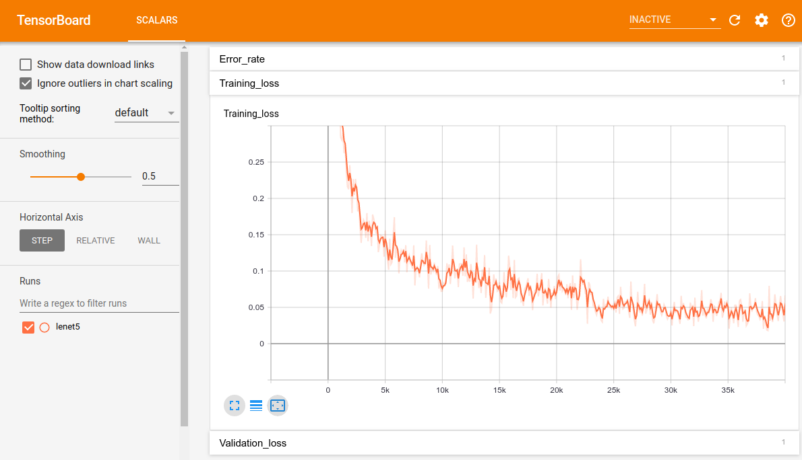

# Torch Hawk
A benchmark on popular deep learning tricks on computer vision tasks with famous datasets. 


## Installation

This project was developed in Python 3.7 with PyTorch 1.1. If you have a previous version of PyTorch, please consider switching `torch.utils.tensorboard` dependency to [tensorboardX](https://github.com/lanpa/tensorboardX).

```bash
git clone https://github.com/frgfm/TorchHawk.git
cd TorchHawk
pip install -r requirements.txt
mkdir img_classification/logs
```


## Usage

How to train your model


### Start your training


```bash
python img_classification/main.py lenet5 --dataset mnist -n 10 --lr 5e-4 --batch_size 8 --optimizer adam --drop_rate 0.3 --workers 8
```


Depending on your seed, you should get similar results to:

```bash
Data transformations:
Compose(
    RandomRotation(degrees=(-30, 30), resample=False, expand=False)
    ToTensor()
    Normalize(mean=(0.1307,), std=(0.3081,))
)

Epoch 1/10 - Validation loss: 0.08775 (Acc@1: 96.97%)                                                                                                           
Validation loss decreased inf --> 0.08775: saving state...
Epoch 2/10 - Validation loss: 0.05491 (Acc@1: 98.20%)                                                                                                           
Validation loss decreased 0.08775 --> 0.05491: saving state...
Epoch 3/10 - Validation loss: 0.06731 (Acc@1: 97.83%)                                                                                                           
Epoch     2: reducing learning rate of group 0 to 2.5000e-04.
Epoch 4/10 - Validation loss: 0.04157 (Acc@1: 98.69%)                                                                                                           
Validation loss decreased 0.05491 --> 0.04157: saving state...
Epoch 5/10 - Validation loss: 0.03381 (Acc@1: 98.85%)                                                                                                           
Validation loss decreased 0.04157 --> 0.03381: saving state...
Epoch 6/10 - Validation loss: 0.03288 (Acc@1: 98.97%)                                                                                                           
Validation loss decreased 0.03381 --> 0.03288: saving state...
Epoch 7/10 - Validation loss: 0.03146 (Acc@1: 99.07%)                                                                                                           
Validation loss decreased 0.03288 --> 0.03146: saving state...
Epoch 8/10 - Validation loss: 0.03196 (Acc@1: 99.03%)                                                                                                           
Epoch     7: reducing learning rate of group 0 to 1.2500e-04.
Epoch 9/10 - Validation loss: 0.02716 (Acc@1: 99.26%)                                                                                                           
Validation loss decreased 0.03146 --> 0.02716: saving state...
Epoch 10/10 - Validation loss: 0.02684 (Acc@1: 99.22%)                                                                                                          
Validation loss decreased 0.02716 --> 0.02684: saving state...

```


### Running the tensorboard interface

Start the tensorboard server locally to visualize your training losses:

```bash
tensorboard --logdir=training-outputs/logs
```

Then open a new tab in your browser and navigate to `<YOUR_COMPUTER_NAME>:6006`  to monitor your training.




## Submitting a request / Reporting an issue

Regarding issues, use the following format for the title:

> [Topic] Your Issue name

Example:

> [State saving] Add a feature to automatically save and load model states